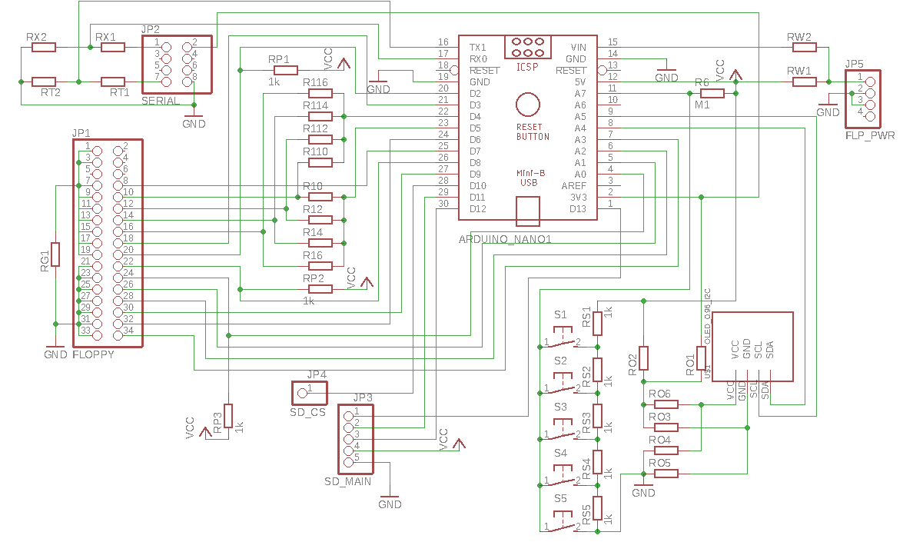

**Schematic legend:**

All resistors without a value represent an option, usually it's an SMD variation of a "jumper", so you can short it by wire or use the resistor with 0 Ohm value

Power options:
|Part | Behaviour |
|-----|-----|
| RW1 | 5V external power supply on leftmost pin of a floppy connector |
| RW2 | Unkown voltage on +5V pin on leftmost pin of a floppy connector  |
| NC  | Arduino power plug will be used instead of floppy connector |

OLED display options:
|Part | Behaviour |
|-----|-----|
| RO1 | 3V3 Power |
| RO2 | 5V Power |
| RO3 + RO4 | pinout: GND, Vcc, SDA, SCL (default for most displays)|
| RO5 + RO6 | pinout: Vcc, GND, SDA, SCL |

Drive select and motor on options:
|Part | Behaviour |
|-----|-----|
| R10 - R16 | Connect D5 pin to respective input from FDC side |
| R110 - R116 | Connect D4 pin to respective input from FDC side |

Default PC config (crossed cable): 
* single drive R12 + R116
* dual drive:  R12 + R114
 
Default Shugart config (straight cable):
* single drive R10 + R116
* dual drive:  R10 + R112

FDC Grounding:
|Part | Behaviour |
|-----|-----|
| RG1 | If short GND on pins 1-3, 7-33, if NC then GND on 21-33 pins only|

Serial options:
|Part | Behaviour |
|-----|-----|
| RX1 | RxD input resistor |
| RX2 | RxD pull-down resistor (only if voltage divider is used) or ESD can be used if desired|
| RT1 | TxD output resistor - usually short|
| RT2 | TxD pull-down resistor - usually NC |

Additional notes:
* **RP**x resistors are 1k pullups
* Push button **S1** is put to the side of the board and can be omitted, as not really needed by firmware
* SD module connector is split because of the stacked config of multiple interconnected PCBs, `/CS` signal must be connected with additional wire
* **PCB in prototype stage! Not tested yet**

